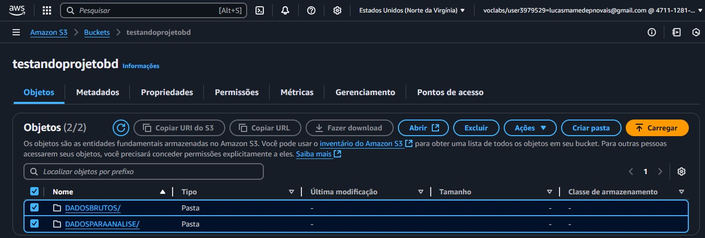
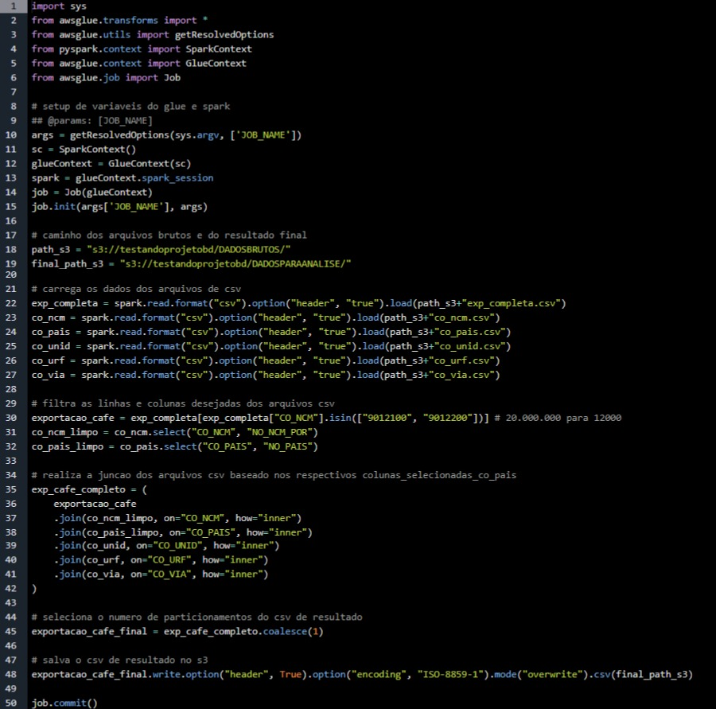

# TÍTULO DO PROJETO: Projeto de Big Data Analytics: Consultoria CodeCafé – Análise de Dados para Expansão Internacional

## 1- RESUMO

Pequena empresa especializada em consultoria de comércio exterior, contratada por uma cooperativa de produtores de cafés especiais do sul de Minas Gerais que busca expandir sua atuação para o mercado internacional, comercializando produtos já beneficiados.
A empresa é composta por uma equipe de seis consultores e dispõe de uma infraestrutura tecnológica moderna, incluindo seis laptops com processador Core i7, 12 GB de RAM e SSD de 512 GB, além de uma impressora a laser. A conectividade é garantida por uma rede cabeada LAN e Wi-Fi, proporcionando um ambiente eficiente para sua atuação.

## 2- INTRODUÇÃO

De acordo com a CECAFE (2025), o Brasil é o maior produtor e exportador de café do mundo, com cerca de 60% da produção destinada ao mercado externo. A tradição do país na cultura do café remonta ao século XIX. Historicamente, o país consolidou sua posição no mercado global como fornecedor de café em grãos, atendendo à demanda de grandes torrefadoras e distribuidores internacionais. No entanto, o cenário tem evoluído, com um crescimento significativo na demanda por cafés especiais e já beneficiados, produtos que agregam maior valor e se destacam pela qualidade, sustentabilidade e rastreabilidade. Esse novo perfil de consumo representa uma grande oportunidade para pequenos produtores brasileiros que desejam conquistar novos mercados e ampliar sua participação no comércio internacional. (LACHMANN, 2023)

A Consultoria CodeCafé é uma pequena empresa especializada em comércio exterior, sediada em Varginha/MG, que prestará serviços para a Cooperativa de Produtores de Cafés Especiais do Sul de Minas Gerais - COOPCAES. A CodeCafé se destaca pela abordagem integrada que une tecnologia e inteligência de mercado para posicionar os cafés especiais no cenário internacional, cada vez mais competitivo e digital.
A cooperativa deseja expandir sua presença no mercado internacional e busca uma análise detalhada dos mercados externos para identificar quais países seriam os melhores destinos para seu produto, bem como quais estratégias devem ser adotadas para otimizar a exportação.

Nesse contexto, o foco principal da Consultoria CodeCafé perante a cooperativa será a prestação de serviços de consultoria em comércio exterior, abrangendo desde a análise de mercado e identificação de potenciais compradores internacionais até a elaboração de estratégias de exportação, logística e documentação alfandegária, muito embora, na primeira fase do projeto contratado pela cooperativa serão abrangidos tão somente as atividades relacionadas à análise de dados históricos sobre a exportação do produto pelo país. A CodeCafé atuará como um elo entre os produtores cooperados da COOPCAES e importadores de café especial em todo o mundo, buscando sempre as melhores oportunidades de negócio para o seu cliente.

**Estrutura de TI:**

**Hardware:**
* 6 notebooks (configuração intermediada: processador Core i7, 12 GB de RAM, SSD 512 GB).
* 1 impressora laser multifuncional (para documentos essenciais).
* Rede cabeada (LAN) e Wi-Fi para acesso à internet.

**Software:**
* Pacote LibreOffice (Writer, Calc, Impress), software livre e de código aberto para gestão administrativa.
* Ferramentas básicas de comunicação (e-mail, WhatsApp, Zoom).
* Planilhas manuais para controle de projetos e clientes.
* Trello para organização de tarefas.

**Serviços de TI:**
* Armazenamento em nuvem limitado (Google Drive) para backups.

**Tipos de Serviços oferecidos pela Consultoria:**
* Assessoria em logística de exportação (documentação, fretes, normas alfandegárias).
* Análise de mercados internacionais (identificação de tendências, concorrência e oportunidades).
* Capacitação em certificações internacionais.
* Gestão de riscos.

## 3 - DIAGNÓSTICO DA SITUAÇÃO-PROBLEMA

A cooperativa enfrenta desafios em sua tentativa de expandir para mercados internacionais:
* **Desconhecimento do mercado internacional:** A cooperativa não sabe quais mercados externos têm maior demanda por café especial, nem como se diferenciar.
* **Falta de conhecimento sobre preços e competição:** Não tem informações claras sobre os preços que seu produto pode alcançar em diferentes países e quais concorrentes dominam esses mercados.
* **Barreiras regulatórias e certificações:** Não conhece as exigências de certificação, regulamentação e logística para exportação.

Dentre a proposta de trabalho contratada entre as partes estão incluídas a pesquisa visando identificar mercados promissores, recomendação de preços competitivos e destacar a principal forma de escoamento do produto para cada país contribuindo assim para melhor definição das estratégias de inserção no mercado internacional.

### 3.1 Metodologia e Análise dos Dados

Para realizar a pesquisa de mercado, a consultoria desenvolverá mecanismos para analisar dados disponíveis sobre exportação de café do Brasil, com foco em:
* **Mapeamento de destinos e forma de escoamento:** Identificar os países que mais importam café especial do Brasil, com ênfase em café beneficiado.
* **Análise de preço e volume:** Analisar os preços médios pagos por mercados internacionais e o volume de café exportado para esses mercados.
* **Identificação de tendências:** Avaliar a demanda por cafés especiais ao longo dos anos, observando possíveis sazonalidades e padrões de crescimento.

## 4 - REPLICAÇÃO E INTEGRAÇÃO DOS DADOS

Para a criação do Big Data Analytics da empresa CodeCafé, foram definidas a infraestrutura e a arquitetura que deverão ser utilizadas para a replicação e integração dos dados. O objetivo é estabelecer um pipeline de dados eficiente para armazenar, processar e visualizar as informações coletadas sobre a exportação de café especial do Brasil e que permita oferecer insights que contribuem para a tomada de decisão, com foco em entender as tendências de exportação e suas variáveis nos mercados internacionais.
Devido à sua infraestrutura robusta e que garante escalabilidade e confiabilidade para o armazenamento de dados, além de amplo conjunto de ferramentas, optou-se por utilizar os serviços de armazenamento em nuvem da AWS (Amazon Web Services). Para isso, foi escolhido Amazon RDS (Relational Database Service), com o PostgreSQL como banco de dados principal, garantindo alto desempenho no gerenciamento das informações.
Os dados coletados, via arquivo CSV obtido do site Kaggle, são armazenados no Google Drive da empresa. Para dar início à análise, dentro do ecossistema AWS, será realizada a ingestão manual desses arquivos para a nuvem Amazon S3. O processo ETL será conduzido pelo AWS Glue. Nessa etapa, os dados serão padronizados e estruturados para melhor atender aos objetivos da pesquisa. A modelagem de dados deverá seguir o formato Star Schema. Para orquestração de workflows, poderá ser utilizado o AWS Step Functions, que coordena várias tarefas dentro da pipeline de dados e fará a carga dos dados transformados para o BD PostgreSQL no Amazon RDS.
Para a etapa de visualização, quando os dados forem efetivamente consumidos no processo de geração de insights, deve-se priorizar o uso de ferramentas que permitam a criação de dashboards dinâmicos e que favoreçam o processo de tomada de decisões. Dentre as várias opções disponíveis, o serviço da Amazon AWS QuickSight é considerada uma boa opção para uso, pois cria relatórios interativos diretamente conectados ao RDS.
A imagem a seguir demonstra o fluxo para pipeline do projeto que corresponde à consultoria para análise de dados para expansão Internacional da Cooperativa COOPCAES.

Imagem 1 - Diagrama da Arquitetura.

**Fonte:** Elaborado pelos autores

## 4.1 Processo de Integração dos Dados

**Fontes de Dados.** Obtenção de arquivos em formato CSV da plataforma de datasets Kaggle (bases abertas).

**Ingestão de Dados.** Será realizada de forma manual para o sistema a ser utilizado, AWS S3 (Amazon Simple Storage Service), que serve para armazenar os dados em nuvem e torná-los escaláveis e seguros.

**Processamento e Transformação (ETL).** Será utilizado o AWS Glue para realizar o processo de ETL (Extract, Transform, Load).

**Orquestração.** O processo de transformação e carregamento dos dados será coordenado pelo Step Functions, que gerencia e automatiza workflows na AWS garantindo execução ordenada e monitorada das etapas.

**Armazenamento.** Os dados processados serão armazenados no Amazon RDS (banco de dados gerenciado) com PostgreSQL.

**Visualização de Dados.** Os dados deverão ser analisados e apresentados através do AWS QuickSight, uma ferramenta de BI para criação de dashboards interativos.

A implementação desta infraestrutura deverá proporcionar à consultoria uma base robusta para tomada de decisões orientadas sobre a exportação de café especial no Brasil, atendendo dessa maneira às necessidades de informações da Cooperativa COOPCAES. A combinação dos serviços AWS oferece segurança, eficiência e escalabilidade, permitindo futuras expansões e aprimoramentos dos processos visando o alcance dos objetivos do projeto.
A imagem abaixo ilustra as etapas de processamento dos dados desde a origem até a visualização. O pipeline foi projetado para demonstrar o fluxo de processamento dos dados dentro do ecossistema de nuvem da AWS.

Imagem 2 - Pipeline de dados.

**Fonte:** Elaborado pelos autores

## 5. ORQUESTRAÇÃO DO PIPELINE DE DADOS

O arquivo “database.db” baixado do site Kaggle, após transformação, é enviado para os serviços de armazenamento em nuvem da AWS (Amazon Web Services), sendo feito o upload do arquivo no bucket criado no S3. Após, utilizando os serviços do AWS Glue, os dados seguem para um serviço de integração e preparação, executando processos de Extração, Transformação e Carga (ETL). Os dados são limpos, enriquecidos e formatados para análise.
Após a transformação, os dados são arquivados em uma pasta no bucket do "Amazon S3". O arquivo poderá ser baixado na máquina, através de download, para ser lido no Power BI, utilizando os dados processados para a geração de insights, dashboards e relatórios, permitindo a tomada de decisões para a Consultoria CodeCafé.

### 5.1 Processo de Orquestração dos Dados

1.  **Download da base de dados original no site Kaggle.** ([https://www.kaggle.com/datasets/juniorfazzio/data-of-brazilian-import-and-export-data](https://www.kaggle.com/datasets/juniorfazzio/data-of-brazilian-import-and-export-data))

    
Imagem 3 - Fonte dos dados, site Kaggle.

    

3.  Durante a instalação da base de dados, identificamos que o arquivo estava no formato ".db", compatível apenas com o SQLite. Para resolver isso, utilizamos a ferramenta DB Browser (Imagem 4), que permite a leitura de arquivos com essa extensão. Com ela, conseguimos converter os dados em múltiplos arquivos .csv, facilitando sua manipulação.

    
Imagem 4 - Conversão do formato do arquivo de “.db” para “.csv” no DB Browser for SQLite.

    

5.  No ambiente AWS, provisionamos um bucket no Amazon S3 para armazenamento dos arquivos “.csv”.

    
Imagem 5 - Criação do bucket no S3.

    

6.  Foram criadas duas pastas no ambiente S3: uma para armazenar os arquivos .csv originais (denominada Dados Brutos) e outra para receber os dados processados após a transformação via ETL (intitulada Dados Para Análise). Essa estrutura permite a separação clara entre os dados em seu estado inicial e os dados prontos para consumo analítico.

    
Imagem 6 - Criação de pastas no bucket do S3.

    

7.  Optou-se pela implementação do processo ETL utilizando o AWS Glue, empregando scripts em Python com a API do PySpark para o processamento distribuído dos dados. A imagem 7 mostra o ambiente onde digitamos o script.

    
Imagem 7 - Script utilizando linguagem Python no AWS Glue para o processamento da base de dados.

    

    
Imagem 8 - Script completo.

    

8.  O script desenvolvido consolida todas as informações em uma única partição, otimizando a integração com o Power BI. Embora o AWS utilize particionamento distribuído por padrão para melhorar a eficiência no processamento de grandes volumes de dados, optamos por uma abordagem monolítica neste caso específico para facilitar o consumo e análise no Power BI.

    
Imagem 9 - Arquivo .csv gerado pelo script no AWS Glue a partir da base de dados.

    

    Na imagem 9 é possível observar o arquivo “.csv” resultante do processo dessa etapa.

    
Imagem 10 - Visualização no Excel do arquivo .csv gerado pelo AWS Glue.

    

## REFERÊNCIAS:

PONTIFÍCIA UNIVERSIDADE CATÓLICA DE MINAS GERAIS. Pró-Reitoria de Graduação. Sistema Integrado de Bibliotecas. **Orientações para elaboração de projetos de pesquisa, trabalhos acadêmicos, relatórios técnicos e/ou científicos e artigos científicos: conforme a Associação Brasileira de Normas Técnicas (ABNT).** 5. ed. Belo Horizonte: PUC Minas, 2023. Disponível em: [www.pucminas.br/biblioteca](www.pucminas.br/biblioteca). Acesso em: 08/03/2024.

CECAFÉ. **Sobre o Café/História do Café - CONSELHO DOS EXPORTADORES DE CAFÉ DO BRASIL.** Site oficial. Disponível em: [https://www.cecafe.com.br/sobre-o-cafe/historia-do-cafe](https://www.cecafe.com.br/sobre-o-cafe/historia-do-cafe). Acesso em: 08/03/ 2025.

LACHMANN. **Conheça mais sobre a história de exportação do café no Brasil.** 2023. Disponível em: [https://www.lachmann.com.br/conheca-mais-sobre-a-historia-de-exportacao-do-cafe-no-brasil/](https://www.lachmann.com.br/conheca-mais-sobre-a-historia-de-exportacao-do-cafe-no-brasil/). Acesso em 08/03/2025.

**Dataset: Data of Brazilian Import and Export data.** Disponível em: [https://www.kaggle.com/datasets/juniorfazzio/data-of-brazilian-import-and-export-data](https://www.kaggle.com/datasets/juniorfazzio/data-of-brazilian-import-and-export-data). Acesso em 8/03/2025.

**Documentação do serviço de banco de dados relacional da Amazon.** Disponível em: [https://aws.amazon.com/pt/documentation-overview/relational-database-service/](https://aws.amazon.com/pt/documentation-overview/relational-database-service/). Acesso em 28/03/25.

**O que é Integração de dados AWS.** Artigo disponível em : [https://aws.amazon.com/pt/what-is/data-integration/](https://aws.amazon.com/pt/what-is/data-integration/). Acesso em 28/03/25.

**Documentação do AWS Glue.** Artigo disponível em:
[https://docs.aws.amazon.com/pt_br/glue](https://docs.aws.amazon.com/pt_br/glue). Acesso em 30/4/2025.